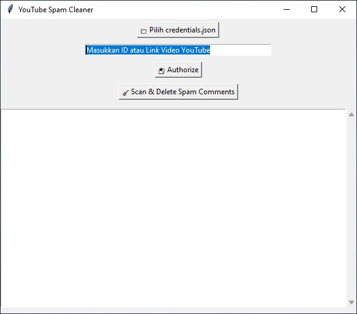

# DestroySpamJudol 🧼

# How To Use | Cara Penggunaan
- Download python 

# ☁️ Siapkan YouTube API
- Buat dulu 
- Masuk ke library
- Lalu cari dan pilih "Youtube Data API v3"
- Lalu tekan pada bagian "Enable"
- Setelah sudah, pilih pada bagian "Create Credentials"
  
- Buka Google Cloud Console
- Aktifkan YouTube Data API v3
- Buat kredensial:
- Masuk ke: API & Services > Credentials

# Install bumbu sebelum memakai
- pip install google-auth google-auth-oauthlib google-auth-httplib2 google-api-python-client

# 🧪 Fitur-fitur:
- ✅ File picker untuk credentials.json
- ✅ Input ID atau link video
- ✅ Otorisasi lewat browser
- ✅ Scan komentar spam berdasarkan karakter Unicode abnormal
- ✅ Hapus komentar spam
- ✅ Log ditampilkan langsung di GUI
